## General System Tasks

1. sudo apt update
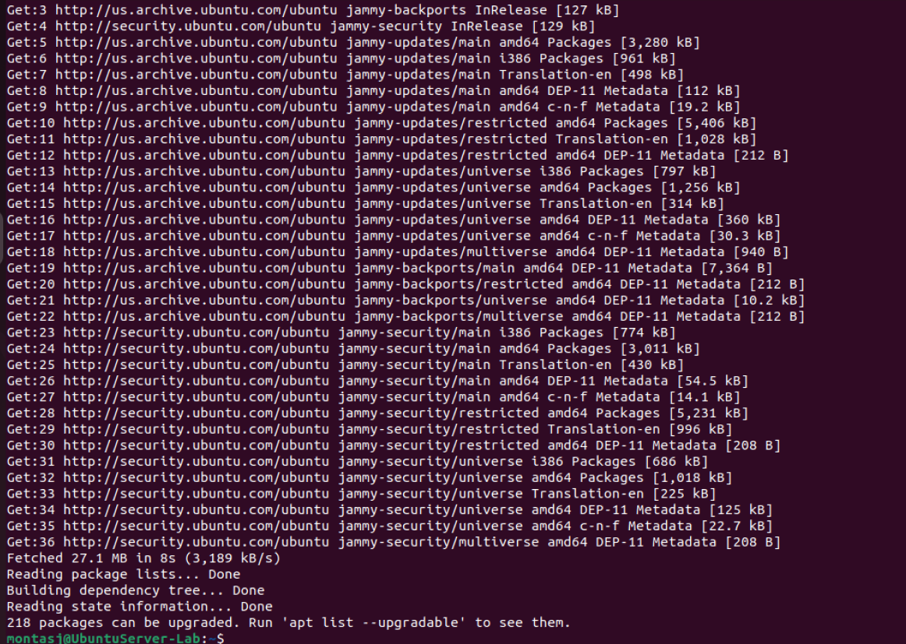

2. sudo apt upgrade
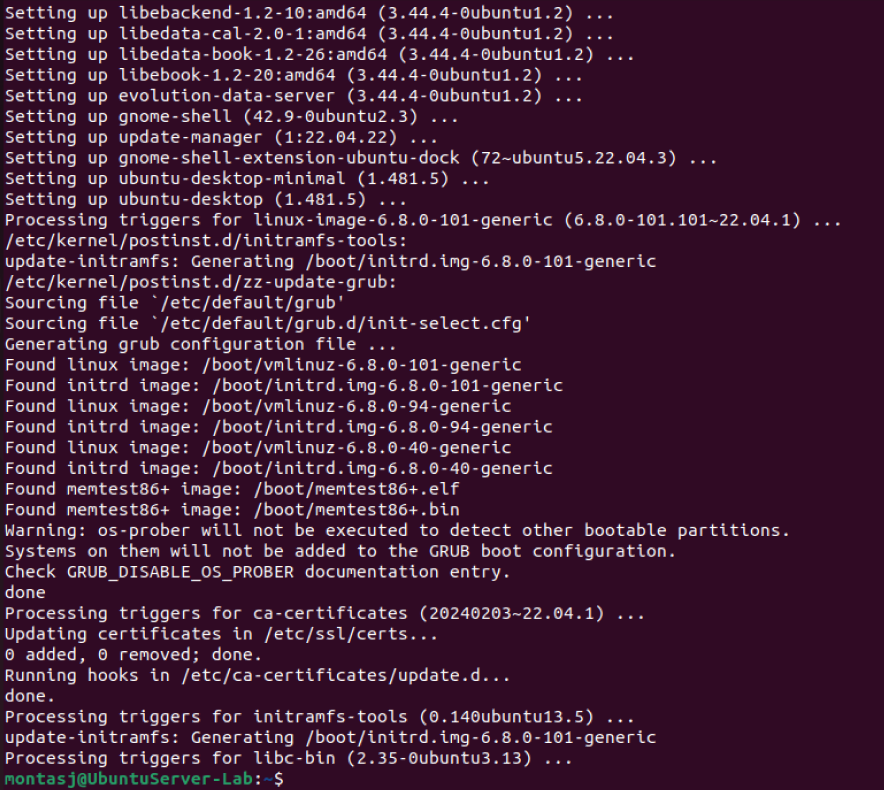 

## User Tasks

4. 
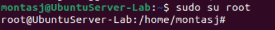

5. Useradd doesn't create a home directory or password by itself, but adduser walks you through steps to add a home directory, password, and other info.
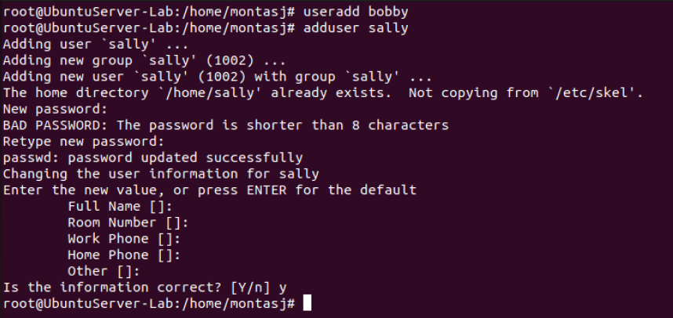

6. 
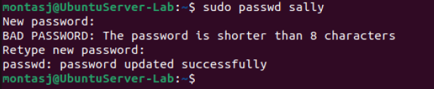

7. Sally cannot create a new user because they are not in the sudo group. In order to give sally more privileges, they would have to be added to the group.
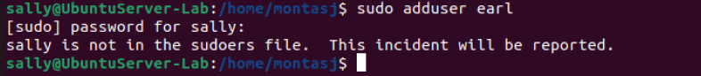

8. The exit command basically logs you out of a user you switch to in the command line, including when you use ssh
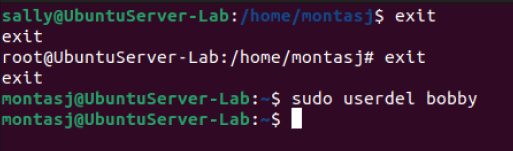

9. The passwd commands allows you to change the password of any user

10. Staying logged into root defeats the purpose of security and safety walls

11. The id command shows user id, group id, and also what groups the user is in
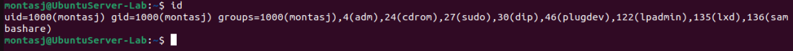

## Group Tasks

12. 
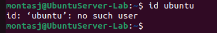

13. 
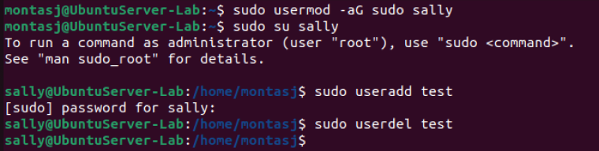

14. The groupadd command allows a user to create a group
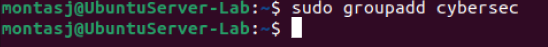

15.
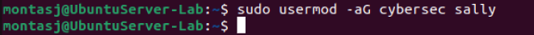

16. the groups command provides a list of groups that is easier to view compared to the id command
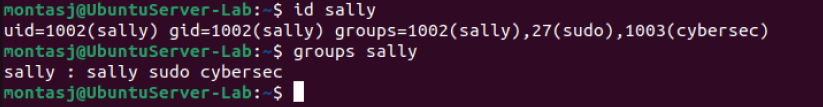

## Permission and Access Control Lists

17. montasj is the owner. montasj is the group owner. They both have read/write/execute permissions
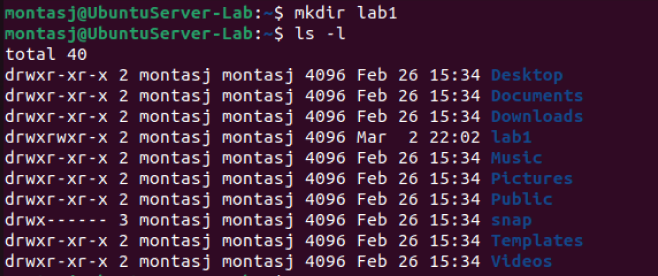

18. 
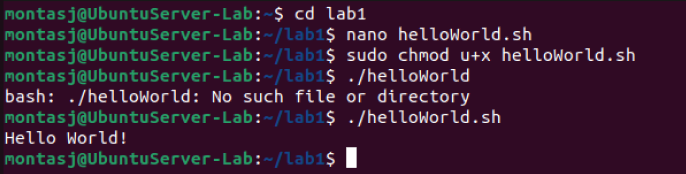

19. Owner: read/write/execute, Group: read/write, Other: read
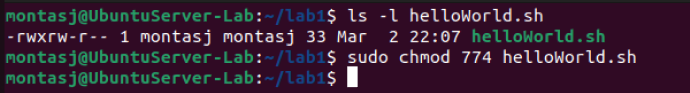

20. The getfacl command displays the access control list of a file/directory
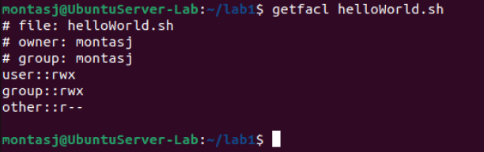

21. The setfacl command gives specific users/groups permissions
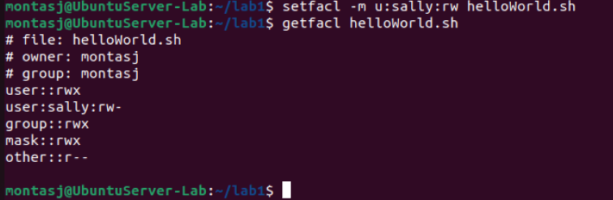