## 2.1 Manipulating Environment Variables

SHELL=/bin/bash
SESSION_MANAGER=local/UbuntuServer-Lab:@/tmp/.ICE-unix/1788,unix/UbuntuServer-Lab:/tmp/.ICE-unix/1788
QT_ACCESSIBILITY=1
COLORTERM=truecolor
XDG_CONFIG_DIRS=/etc/xdg/xdg-ubuntu:/etc/xdg
SSH_AGENT_LAUNCHER=gnome-keyring
XDG_MENU_PREFIX=gnome-
GNOME_DESKTOP_SESSION_ID=this-is-deprecated
GNOME_SHELL_SESSION_MODE=ubuntu
SSH_AUTH_SOCK=/run/user/1000/keyring/ssh
XMODIFIERS=@im=ibus
DESKTOP_SESSION=ubuntu
GTK_MODULES=gail:atk-bridge
PWD=/home/montasj/lab2
LOGNAME=montasj
XDG_SESSION_DESKTOP=ubuntu
XDG_SESSION_TYPE=wayland
SYSTEMD_EXEC_PID=1814
XAUTHORITY=/run/user/1000/.mutter-Xwaylandauth.P86PM3
HOME=/home/montasj
USERNAME=montasj
IM_CONFIG_PHASE=1
LANG=en_US.UTF-8
LS_COLORS=rs=0:di=01;34:ln=01;36:mh=00:pi=40;33:so=01;35:do=01;35:bd=40;33;01:cd=40;33;01:or=40;31;01:mi=00:su=37;41:sg=30;43:ca=30;41:tw=30;42:ow=34;42:st=37;44:ex=01;32:*.tar=01;31:*.tgz=01;31:*.arc=01;31:*.arj=01;31:*.taz=01;31:*.lha=01;31:*.lz4=01;31:*.lzh=01;31:*.lzma=01;31:*.tlz=01;31:*.txz=01;31:*.tzo=01;31:*.t7z=01;31:*.zip=01;31:*.z=01;31:*.dz=01;31:*.gz=01;31:*.lrz=01;31:*.lz=01;31:*.lzo=01;31:*.xz=01;31:*.zst=01;31:*.tzst=01;31:*.bz2=01;31:*.bz=01;31:*.tbz=01;31:*.tbz2=01;31:*.tz=01;31:*.deb=01;31:*.rpm=01;31:*.jar=01;31:*.war=01;31:*.ear=01;31:*.sar=01;31:*.rar=01;31:*.alz=01;31:*.ace=01;31:*.zoo=01;31:*.cpio=01;31:*.7z=01;31:*.rz=01;31:*.cab=01;31:*.wim=01;31:*.swm=01;31:*.dwm=01;31:*.esd=01;31:*.jpg=01;35:*.jpeg=01;35:*.mjpg=01;35:*.mjpeg=01;35:*.gif=01;35:*.bmp=01;35:*.pbm=01;35:*.pgm=01;35:*.ppm=01;35:*.tga=01;35:*.xbm=01;35:*.xpm=01;35:*.tif=01;35:*.tiff=01;35:*.png=01;35:*.svg=01;35:*.svgz=01;35:*.mng=01;35:*.pcx=01;35:*.mov=01;35:*.mpg=01;35:*.mpeg=01;35:*.m2v=01;35:*.mkv=01;35:*.webm=01;35:*.webp=01;35:*.ogm=01;35:*.mp4=01;35:*.m4v=01;35:*.mp4v=01;35:*.vob=01;35:*.qt=01;35:*.nuv=01;35:*.wmv=01;35:*.asf=01;35:*.rm=01;35:*.rmvb=01;35:*.flc=01;35:*.avi=01;35:*.fli=01;35:*.flv=01;35:*.gl=01;35:*.dl=01;35:*.xcf=01;35:*.xwd=01;35:*.yuv=01;35:*.cgm=01;35:*.emf=01;35:*.ogv=01;35:*.ogx=01;35:*.aac=00;36:*.au=00;36:*.flac=00;36:*.m4a=00;36:*.mid=00;36:*.midi=00;36:*.mka=00;36:*.mp3=00;36:*.mpc=00;36:*.ogg=00;36:*.ra=00;36:*.wav=00;36:*.oga=00;36:*.opus=00;36:*.spx=00;36:*.xspf=00;36:
XDG_CURRENT_DESKTOP=ubuntu:GNOME
VTE_VERSION=6800
WAYLAND_DISPLAY=wayland-0
GNOME_TERMINAL_SCREEN=/org/gnome/Terminal/screen/c5f02dbb_0846_4f82_a558_9acaa0119537
GNOME_SETUP_DISPLAY=:1
LESSCLOSE=/usr/bin/lesspipe %s %s
XDG_SESSION_CLASS=user
TERM=xterm-256color
LESSOPEN=| /usr/bin/lesspipe %s
USER=montasj
GNOME_TERMINAL_SERVICE=:1.122
DISPLAY=:0
SHLVL=1
QT_IM_MODULE=ibus
XDG_RUNTIME_DIR=/run/user/1000
XDG_DATA_DIRS=/usr/share/ubuntu:/usr/local/share/:/usr/share/:/var/lib/snapd/desktop
PATH=/usr/local/sbin:/usr/local/bin:/usr/sbin:/usr/bin:/sbin:/bin:/usr/games:/usr/local/games:/snap/bin:/snap/bin
GDMSESSION=ubuntu
DBUS_SESSION_BUS_ADDRESS=unix:path=/run/user/1000/bus
_=/usr/bin/printenv
OLDPWD=/home/montasj/lab2/Labsetup

## 2.2 Passing Environment Variables from Parent Process to Child Process

**Step 1**

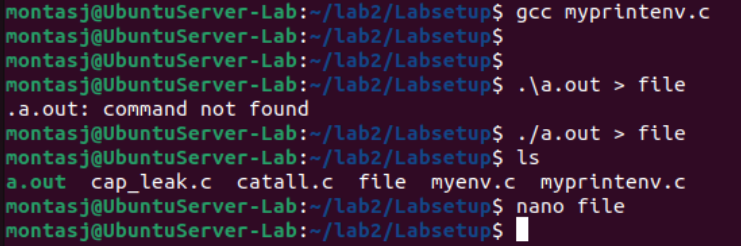

**Step 2**

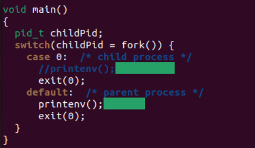

Child process was commented out, parent process was uncommented

**Step 3**

After using the diff command, it showed me that there were no differences in the files meaning that the parent’s environment variables are inherited by the child process.

## 2.3 Environment Variables and execve()

**Step 1**

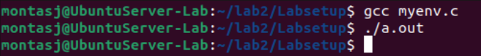

At first, nothing happens when I run myenv.c

**Step 2**

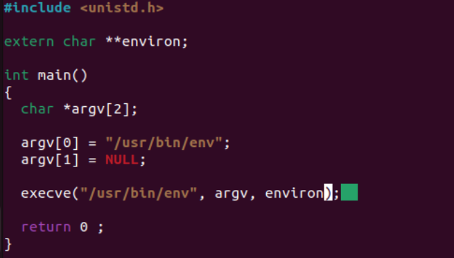

NULL changed to environ

After the invocation of execve() was changed, running the program now displays the environment variables

**Step 3**

The new program gets its environment variables from the execve() command, specifically from environ

## 2.4 Environment Variables and system()

After writing and compiling the program, the program gave an output of the environment variables

## 2.5 Environment Variables and Set-UID Programs

**Step 1**

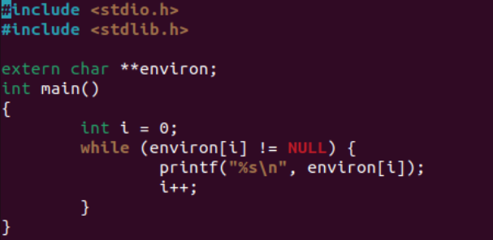

**Step 2**

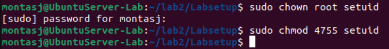

**Step 3**

After using the export command for PATH, LD_LIBRARY_PATH, and a variable named TEST, only PATH AND TEST showed up in the list of environment variables when I ran the program. I was shocked to see that LD_LIBRARY_PATH wasn't listed

## 2.6 The PATH Environment Variable and Set-UID Programs

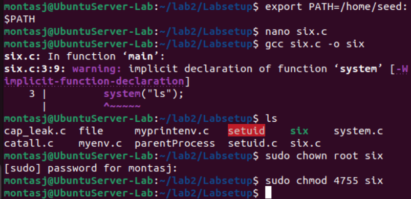
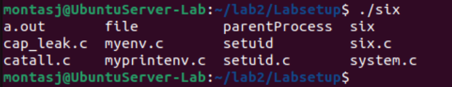

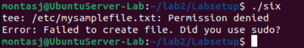

In my lab2/Labsetup folder, I created a file named 'ls' that creates a file in /etc, which would need sudo permissions. I then entered the command "export PATH=/home/montasj/lab2/Labsetup:$PATH" and ran the program. It executed the 'ls' file I created, but without root privileges.

## 2.7 The LD_PRELOAD Environment Variable and Set-UID Programs

**Step 1**

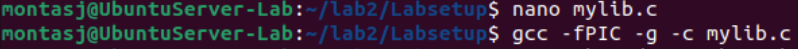
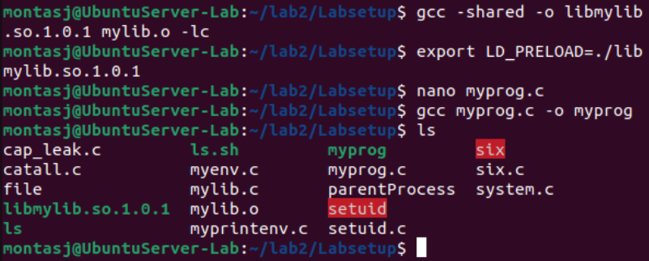

**Step 2**

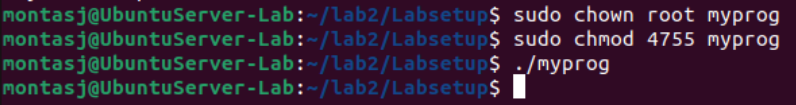
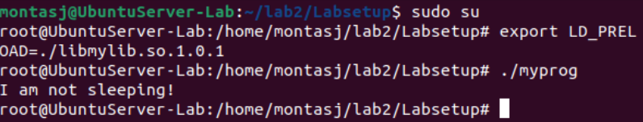
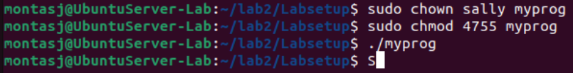

The program only successfully printed "I am not sleeping!" when I first ran it, and when I switched to the root account. Once the file owner was changed to sally, I switched to their account. When I ran the file it gave the usual output. However when I switched back to my account and tried to run the program with sudo, it still gave me no output which was surprising.

## 2.8 Invoking External Programs Using system() versus execve()

**Step 1**

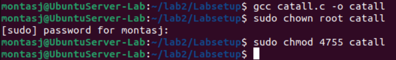
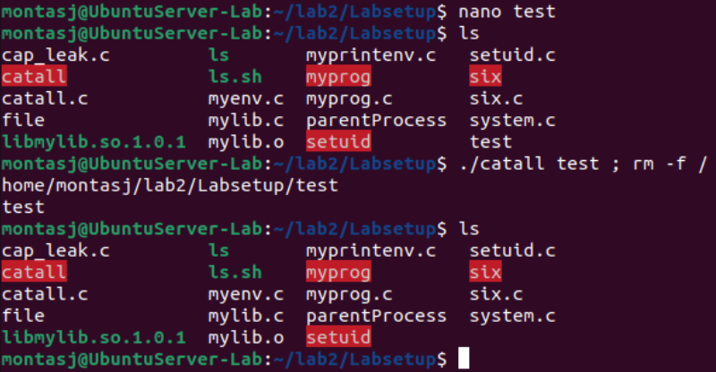

I used ';' to add another command after specifying which file I wanted to read, that allowed me to remove a file

**Step 2**

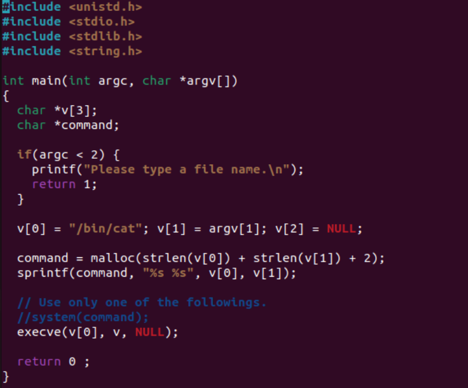

Commented out system and removed comment from execve

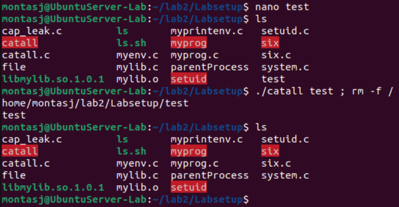

My attack still worked

## 2.9 Capability Leaking

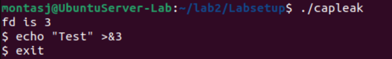
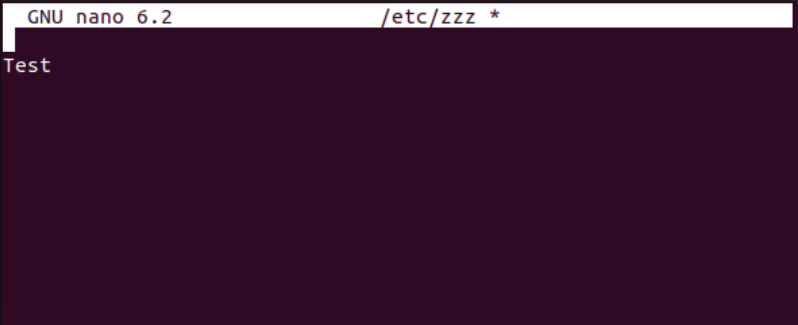

I was easily able to write to the file by using an echo command in the shell